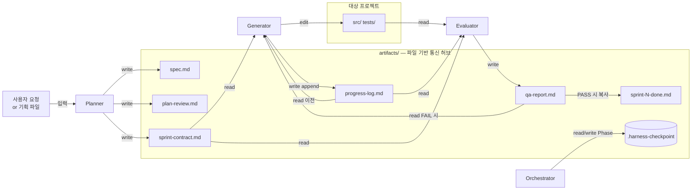
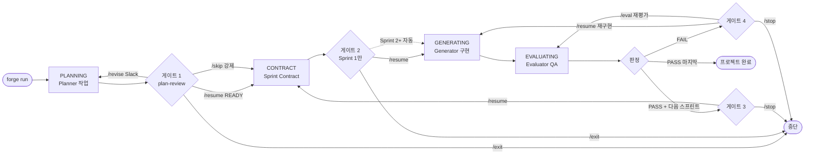

# THE FORGE


> Claude Code CLI 위에 얹는 **5-Phase 자율 개발 하네스**. Planner → Generator → Evaluator가 스프린트를 돌리고, Slack 또는 Telegram으로 원격 제어한다. Max 플랜 구독 쿼터 안에서 동작.

---

## 60초 시작

```bash
# 1) 설치 (한 번만)
git clone https://github.com/HWAIN/THE_FORGE.git && cd THE_FORGE
uv sync && uv tool install .

# 2) 전역 설정 마법사 — Slack 또는 Telegram 토큰 입력 (한 번만)
forge setup

# 3) 내 프로젝트 초기화 (프로젝트마다 한 번)
cd /path/to/my-project && forge init

# 4) 실행
forge run "만들고 싶은 것"
```

사전 요구사항(Claude Code Max 플랜, uv, Slack Bot 또는 Telegram Bot): [USER_GUIDE 1절](./docs/USER_GUIDE.md#1-사전-요구사항--토큰-발급).

---

## 1. 무엇인가

Anthropic의 원본 3-에이전트 하네스는 **Agent SDK + API 종량제**로 동작했다. 2026-04 정책 변경으로 제3자 도구(Cursor, OpenClaw 등)는 Pro/Max 구독 쿼터에서 제외되었고, **Claude Code CLI만 월정액 구독으로 사용 가능**하다.

THE FORGE는 그 제약 안에서 원본의 핵심 이점(역할 분리, 자기 합리화 방지, QA 객관성)을 보존하기 위해 **Agent SDK를 버리고 공식 `claude` CLI를 `subprocess`로 호출**하는 방식으로 재구성한 오케스트레이터다. Python 스크립트가 Phase 순서만 제어하고, 실제 LLM 실행은 Claude Code의 완성된 하네스(도구 시스템, 권한 모델, 컴팩션)를 그대로 활용한다.

---

## 2. 네 가지 설계 선택

이 프로젝트가 지금의 모습으로 나온 네 가지 결정.

### 2.1 harness-over-harness

Claude Code CLI 자체가 이미 완성된 하네스다. THE FORGE는 그 위에 "Planner → Generator → Evaluator 순서 제어 + QA 루프"만 Python으로 얹는다. Agent SDK는 쓰지 않는다. 이유: **Max 플랜 구독 쿼터 안에서 동작**시키려면 공식 CLI 경로가 유일한 선택이기 때문.

### 2.2 3-프로세스 분리 (역할 격리)

세 에이전트를 각각 별도의 `subprocess`로 실행한다. 하나의 연속 세션에서 역할만 바꾸는 방식은 **자기 합리화(self-rationalization)** 를 일으킨다 — Generator가 방금 짠 코드를 같은 세션의 Evaluator가 무의식적으로 두둔한다. 프로세스를 물리적으로 격리하면 Evaluator는 Generator의 맥락 없이 결과물과 스펙만 보고 판정하므로 객관성이 유지된다.

### 2.3 파일 기반 통신

에이전트 간 모든 통신은 `artifacts/` 디렉토리의 마크다운 파일을 통해서만 일어난다. 직접 메모리 공유도, 메시지 큐도 없다. 얻는 것: (1) 매 Phase마다 체크포인트가 파일 시스템에 자연스럽게 누적 → 크래시 후 복구 자동화, (2) 사용자가 중간에 `spec.md`나 `sprint-contract.md`를 **수동으로 편집**해 개입 가능, (3) `sprint-N-done.md` 아카이브가 Git으로 추적되어 프로젝트 히스토리로 남음.

### 2.4 원격 승인 게이트 (Slack / Telegram)

Generator가 코드를 짜는 동안은 자율이지만, **방향 전환 결정은 사람이 한다**. PLANNING 완료 후의 plan-review 검토, Sprint 1 CONTRACT 승인, QA FAIL 시 재시도/재평가 선택 — 이 지점마다 오케스트레이터는 멈추고 `/resume` `/skip` `/exit` `/eval` `/stop` `/revise` 명령을 기다린다. Slack Slash Commands와 버튼 UX, Telegram 메시지 모두 지원.

---

## 3. 아키텍처

두 가지 시점으로 나눠 표현한다.

### 3.1 에이전트 I/O 흐름 (무엇을 읽고 무엇을 쓰는가)



- **Planner** 입력: 사용자 요청 또는 `--plan FILE`. 출력: `spec.md`, `plan-review.md`, `sprint-contract.md`.
- **Generator** 입력: `sprint-contract.md` + 이전 `progress-log.md` + (FAIL 시) `qa-report.md`. 출력: `progress-log.md` append + 실제 소스 편집.
- **Evaluator** 입력: `sprint-contract.md` + `progress-log.md` + 소스 코드. 출력: `qa-report.md` 단 하나.
- 에이전트 간 **직접 통신은 없다** — 오직 `artifacts/` 파일을 통해서만 상태를 주고받는다 (설계 선택 2.3 근거).

### 3.2 사용자 시간순 의사결정 (언제 어떤 선택을 하는가)



- **자동 전이**: `PLANNING → CONTRACT → GENERATING → EVALUATING`은 사용자 개입 없이 진행.
- **게이트 1**: `plan-review.md` 상태가 `NEEDS_REVISION`이면 `/resume`이 막히고 `/skip`만 강제 진행시킨다.
- **게이트 2**: Sprint 1의 CONTRACT 완료 직후만 멈춘다. Sprint 2+의 CONTRACT는 자동 진행(첫 승인으로 전체 위임).
- **명령어 채널**: Slack 버튼 · Slash Command · Telegram 메시지 · 시그널 파일(`touch artifacts/.approval-signal`) · 터미널 Enter 중 아무거나.

---

## 4. v2.3의 새로운 것

- **자동 스프린트 루프** — `sprint-contract.md`의 `has_next_sprint` 플래그로 여러 스프린트를 끊김 없이 연속 실행. `--single-sprint`로 단일 모드 전환.
- **Slack Slash Commands** — `/forge-status [project_name]`으로 실행 중 프로세스 조회, `/revise` 모달로 spec.md 수정 지시 입력.
- **`forge setup` 전역 마법사** — `~/.forge/config.env`를 생성해 Slack/Telegram 토큰을 전역 공유. Slack이 기본값.
- **`forge journal`** — 스프린트 히스토리를 `docs/journal.md`로 누적 (범위: `--sprint`, `--sprints`, `--since`).
- **`forge update-templates` / `forge update-agents`** — 본체 업그레이드 후 프로젝트의 scaffold를 최신 버전으로 재동기화.
- **안전장치 3종** — 누적 스프린트 한도(`FORGE_MAX_TOTAL_SPRINTS`), 연속 FAIL 한도(`FORGE_MAX_CONSECUTIVE_FAILS`), 누적 시간 한도(`FORGE_MAX_TOTAL_MINUTES`)로 무한 루프를 차단하고 체크포인트를 유지한 채 종료.

---

## 5. 설치 & 실행

### 사전 요구사항

- **Python 3.12+**, **uv**, **Claude Code CLI (Max 플랜)**, **Git**
- 원격 제어: **Slack Bot** (권장) 또는 **Telegram Bot** 중 하나
- 선택: **Node.js 18+** (Playwright E2E), **Langfuse 계정** (LLM 트레이싱)

상세 토큰 발급 절차: [USER_GUIDE 1.3](./docs/USER_GUIDE.md#13-토큰-발급-절차).

### 실행 패턴 3가지

```bash
# 패턴 A — 짧은 요청 (spec.md 없이)
forge run "LangGraph 기반 대화 에이전트 뼈대 만들어줘"

# 패턴 B — 기획서 파일로 시작
forge run --plan ./my-plan.md

# 패턴 C — 크래시 후 자동 복구 (체크포인트가 있으면 인자 불필요)
forge run
```

각 패턴의 내부 동작, `--from PHASE` 강제 재진입, 원격 제어 명령 전체: [USER_GUIDE 6절](./docs/USER_GUIDE.md#6-forge-run--실행의-모든-것).

---

## 6. CLI 요약

10개 명령. 자세한 옵션은 `forge --help` 또는 [USER_GUIDE 부록 C](./docs/USER_GUIDE.md#부록-c-cli-명령-한눈에).

| 명령 | 한 줄 설명 |
|---|---|
| `forge run [요청]` | 5-Phase 스프린트 루프 (자동 다음 스프린트 지원) |
| `forge eval` | Evaluator만 재실행 |
| `forge status` | 현재 체크포인트/Phase/누적시간 조회 |
| `forge setup` | 전역 설정 마법사 *(v2.3)* |
| `forge init` | 프로젝트 scaffold 복사 |
| `forge journal` | 엔지니어링 저널 누적 *(v2.3)* |
| `forge update-templates` | scaffold/templates 최신화 *(v2.3)* |
| `forge update-agents` | scaffold/agents 최신화 *(v2.3)* |
| `forge notify TYPE MSG [FILE]` | Hooks용 일회성 알림 |
| `forge version` | 버전 출력 |

---

## 7. 설정 요약

**우선순위 체인** (강→약):

1. 프로세스 환경 변수 (`FORGE_*`)
2. 프로젝트 `.env`
3. 전역 `~/.forge/config.env` (`forge setup`이 생성)
4. `pyproject.toml [tool.forge]` 또는 `forge.toml`
5. 내장 기본값

**자주 쓰는 키**:

| 키 | 기본값 | 설명 |
|---|---|---|
| `FORGE_NOTIFIER_BACKEND` | `telegram` | `slack` 또는 `telegram` |
| `FORGE_SLACK_BOT_TOKEN` / `_APP_TOKEN` / `_CHANNEL` | — | Slack 3종 |
| `FORGE_TELEGRAM_BOT_TOKEN` / `_CHAT_ID` | — | Telegram 2종 |
| `FORGE_MAX_SPRINT_MINUTES` | `180` | 스프린트 시간 예산 |
| `FORGE_MAX_CONSECUTIVE_FAILS` | `3` | 안전장치 |
| `FORGE_LANGFUSE_PUBLIC_KEY` / `_SECRET_KEY` | — | 선택, 비어있으면 no-op |

전체 환경 변수 27종: [USER_GUIDE 5.3](./docs/USER_GUIDE.md#53-모든-forge_-환경-변수).

---

## 8. 원본 하네스와의 비교

2026-04 Anthropic 정책 변경으로 **Claude Code CLI만 Max 구독 쿼터 사용 가능** (제3자 도구 제외). THE FORGE는 공식 CLI를 `subprocess`로 호출하여 월정액 구독 안에서 동작한다.

| 관점 | 원본 Agent SDK (2026.03) | THE FORGE |
|---|---|---|
| 세션 | 연속 세션, 역할 전환 | 3개 별도 프로세스 (물리적 격리) |
| 비용 | API 종량제 | Max 플랜 월정액 구독 |
| 에이전트 간 통신 | 동일 세션 메모리 | `artifacts/` 파일 기반 |
| 사용자 개입 | 없음 (완전 자율) | Slack/Telegram 승인 + `/revise` 모달 |

<details>
<summary>전체 비교 (13행)</summary>

|  | Anthropic V2 원본 (2026.03) | THE FORGE (Python subprocess) |
|---|---|---|
| **세션 구조** | 하나의 연속 세션 (역할만 전환) | 3개 별도 프로세스 (`subprocess.run()`) |
| **오케스트레이터** | Agent SDK (Python/TypeScript) | Python 스크립트 (`run_cycle()`) |
| **Planner** | 같은 세션에서 역할 전환 프롬프트 | `claude -p --agent planner` (비대화형) |
| **Generator** | 같은 세션에서 코딩 (완전 자율) | `claude -p --agent generator --max-turns N --permission-mode bypassPermissions` |
| **Evaluator** | 같은 세션에서 QA (Playwright MCP) | `claude -p --agent evaluator` (비대화형) |
| **컨텍스트 관리** | SDK 자동 컴팩션 | 세션 분리로 격리 + Claude Code 내장 컴팩션 |
| **에이전트 간 통신** | 파일 기반 (`artifacts/`) | 파일 기반 (`artifacts/`) |
| **인간 개입** | 없음 (완전 자율) | 승인 게이트 + Slack/Telegram + `/revise` 모달 |
| **비용 청구** | API 과금 ($200/6시간 예시) | Max 플랜 (월정액 구독) |
| **SDK 의존성** | 필수 (`claude-agent-sdk`) | 없음 (CLI만 사용) |
| **원격 알림** | 없음 | Slack (Socket Mode + Slash Commands) 또는 Telegram |
| **체크포인트 복구** | 없음 (연속 세션이므로) | 있음 (`.harness-checkpoint` + Phase IntEnum) |
| **Windows 호환** | SDK anyio 충돌 보고 | 네이티브 (`pathlib`, `subprocess`, `msvcrt`) |
| **도구 제어** | 개발자가 tool schema 직접 정의 | Claude Code 내장 (Read/Write/Bash + MCP/Skill) |

보존된 원본의 핵심 이점: 역할 분리, 자기 합리화 방지, Evaluator의 물리적 격리.

</details>

---

## 9. 문서 안내

| 문서 | 대상 | 내용 |
|---|---|---|
| [docs/USER_GUIDE.md](./docs/USER_GUIDE.md) | 사용자 | 설치·실행·설정·트러블슈팅·복구 시나리오 전체 |
| [docs/DEV.md](./docs/DEV.md) | 기여자 | 테스트·린트·코드 레퍼런스 (파일:라인) |
| [docs/핵심기술.md](./docs/핵심기술.md) | 설계 심화 | 아키텍처 내부 설계 · 결정 배경 |

막힌 에러가 있다면 [USER_GUIDE 에러 빠른 찾기](./docs/USER_GUIDE.md#에러-빠른-찾기) 표에서 메시지로 검색.

---

MIT License. Claude Code는 Anthropic의 제품이며 THE FORGE는 그 위에서 동작하는 독립 오케스트레이터다.
