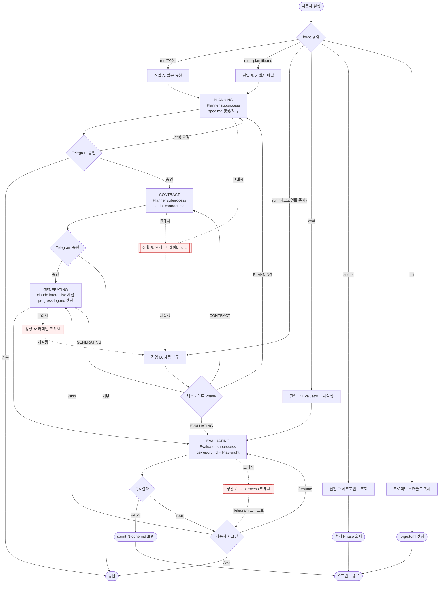
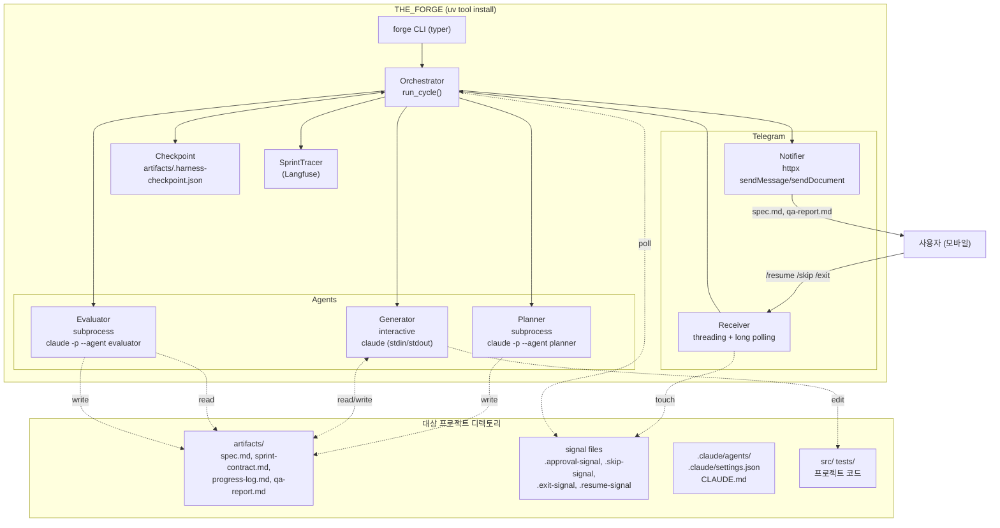
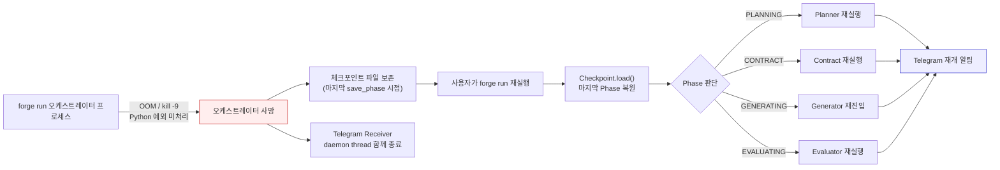
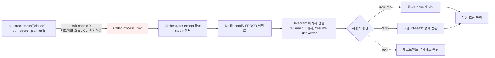
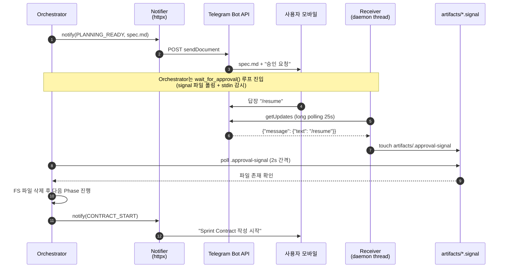

# THE FORGE


> Claude Code CLI 위에 얹는 **범용 하네스 오케스트레이터(harness-over-harness)**. Planner → Generator → Evaluator 3-에이전트 사이클을 Python subprocess로 제어하여 Max 플랜 구독 쿼터 안에서 자율 개발 루프를 운영한다.

---

## 목차

1. [핵심 컨셉](#핵심-컨셉-harness-over-harness)
2. [주요 기능](#주요-기능)
3. [기술 스택](#기술-스택)
4. [전체 워크플로 분기](#전체-워크플로-분기)
5. [아키텍처](#아키텍처)
6. [원본 하네스와의 비교](#원본-하네스와의-비교)
7. [빠른 시작](#빠른-시작)
8. [CLI 레퍼런스](#cli-레퍼런스)
9. [설정 (forge.toml / 환경 변수)](#설정-forgetoml--환경-변수)
10. [프로젝트 구조](#프로젝트-구조)
11. [크래시 복구와 Telegram 활용](#크래시-복구와-telegram-활용)
12. [개발 가이드](#개발-가이드)
13. [문제 해결](#문제-해결-troubleshooting)
14. [관련 문서](#관련-문서)


---

## 핵심 컨셉: harness-over-harness

Claude Code 자체가 이미 완성된 하네스(harness)다. **THE_FORGE는 그 위에 "Planner → Generator → Evaluator 순서 제어"라는 오케스트레이션 레이어를 얹는다.** Claude Code의 도구 시스템(Read, Write, Bash, Glob, ...), 권한 모델, 자동 컴팩션(compaction)을 그대로 활용하면서, 스프린트 사이클과 QA 루프만 Python으로 제어한다.

- **Agent SDK 의존성 제거**: `subprocess`로 공식 `claude` CLI를 호출 → Max 플랜 구독 쿼터 내에서 동작
- **역할 분리(Role Separation)**: 3개의 독립 프로세스로 컨텍스트를 물리적으로 격리 → 자기 합리화(self-rationalization) 방지
- **파일 기반 통신**: 에이전트 간 모든 통신은 `artifacts/` 디렉토리의 마크다운 파일을 통해서만 수행

---

## 주요 기능

- **3-에이전트 사이클** — Planner(subprocess 비대화형) → Generator(interactive 세션) → Evaluator(subprocess 비대화형)
- **체크포인트 자동 복구** — 예기치 않은 크래시 시 `artifacts/.harness-checkpoint.json`에서 마지막 Phase부터 재개
- **Telegram 양방향 제어** — 스펙/리뷰/QA 결과를 모바일로 수신하고 `/resume` `/skip` `/exit` 명령으로 원격 제어
- **Langfuse 이중 추적(dual tracing)** — 하네스 메타 레벨(스프린트 소요 시간)과 프로젝트 코드 레벨(LLM 호출)을 분리 추적
- **크로스 플랫폼** — Windows(`msvcrt.kbhit`) / macOS / Linux(`select.select`) stdin 대기 자동 분기

---

## 기술 스택

### Backend
- **Python 3.12+** — 타입 힌트 기반 Pydantic 모델
- **typer 0.12+** — 선언형 CLI
- **pydantic 2.x / pydantic-settings** — `forge.toml` + 환경 변수 통합 로드
- **httpx 0.27+** — Telegram Bot API HTTPS 클라이언트

### Observability
- **Langfuse 2.x** (선택) — Trace/Span 기반 스프린트 관측
- **rich 13+** — 터미널 상태 테이블 렌더링

### External Dependencies
- **Claude Code CLI** (Max 플랜) — 실제 LLM 실행 주체
- **Telegram Bot API** — 원격 승인 게이트

### Dev / Build
- **uv** — 패키지/의존성 관리, `uv tool install`
- **pytest 8.x / pytest-asyncio** — 유닛 테스트
- **ruff 0.4+** — 린트

---

## 전체 워크플로 분기

`forge` 명령 진입부터 스프린트 종료까지의 모든 분기를 한 다이어그램으로 표현한다.



> **크래시 분기**는 [크래시 복구와 Telegram 활용](#크래시-복구와-telegram-활용) 섹션에서 상세히 설명한다.

---

## 아키텍처



---

## 원본 하네스와의 비교

2026년 4월부터 Anthropic 정책이 엄격해졌다: **Claude Code CLI, claude.ai, Claude Desktop, Claude Cowork**만 Pro/Max 구독 쿼터를 사용할 수 있고, 제3자 도구(OpenClaw, Cursor 등)는 더 이상 포함되지 않는다. THE_FORGE는 `subprocess`로 공식 `claude` CLI를 호출하여 **Max 플랜 구독 쿼터 내에서 동작**한다.

|  | Anthropic V2 원본 (2026.03) | THE_FORGE (Python subprocess) |
|---|---|---|
| **세션 구조** | 하나의 연속 세션 (역할만 전환) | 3개 별도 프로세스 (`subprocess.run()`) |
| **오케스트레이터** | Agent SDK (Python/TypeScript) | Python 스크립트 (`run_cycle()`) |
| **Planner** | 같은 세션에서 역할 전환 프롬프트 | `claude -p --agent planner` (비대화형) |
| **Generator** | 같은 세션에서 코딩 (완전 자율) | `claude` interactive (사용자 개입 가능) |
| **Evaluator** | 같은 세션에서 QA (Playwright MCP) | `claude -p --agent evaluator` (비대화형) |
| **컨텍스트 관리** | SDK 자동 컴팩션 | 세션 분리로 격리 + Claude Code 내장 컴팩션 |
| **에이전트 간 통신** | 파일 기반 (`artifacts/`) | 파일 기반 (`artifacts/`) |
| **인간 개입** | 없음 (완전 자율) | 있음 (Generator 대화형 + Telegram 승인 게이트) |
| **비용 청구** | API 과금 ($200/6시간 예시) | Max 플랜 (월정액 구독) |
| **SDK 의존성** | 필수 (`claude-agent-sdk`) | 없음 (CLI만 사용) |
| **Telegram 알림** | 없음 | 양방향 (`notifier.py` + `receiver.py` threading) |
| **체크포인트 복구** | 없음 (연속 세션이므로) | 있음 (`Checkpoint` Pydantic 모델) |
| **Windows 호환** | SDK anyio 충돌 보고 | 네이티브 (`pathlib`, `subprocess`, `msvcrt`) |
| **도구 제어** | 개발자가 tool schema 직접 정의 | Claude Code 내장 (Read/Write/Bash + MCP/Skill) |

**보존된 원본의 핵심 이점**: 역할 분리(Role Separation), 자기 합리화 방지, Evaluator의 물리적 격리.

---

## 빠른 시작

### 사전 요구사항

- **Python 3.12+**
- **uv** — `curl -LsSf https://astral.sh/uv/install.sh | sh` (Windows: PowerShell 설치 스크립트)
- **Claude Code CLI** — Max 플랜 구독 필요 ([claude.com/code](https://claude.com/code))
- **Telegram Bot** — `@BotFather`에서 `/newbot`으로 생성, `TELEGRAM_BOT_TOKEN`과 `TELEGRAM_CHAT_ID` 확보
- **Node.js** (선택) — Playwright E2E 자동 실행 시

### 설치

```bash
git clone https://github.com/HWAIN/THE_FORGE.git
cd THE_FORGE
uv sync
uv tool install .

# Langfuse 추적 활성화 (선택)
uv tool install ".[langfuse]"
```

### 프로젝트 초기화

```bash
cd /path/to/my-project
forge init
```

생성되는 파일:
- `CLAUDE.md` — Generator 시스템 프롬프트
- `.claude/agents/planner/AGENT.md`, `.claude/agents/evaluator/AGENT.md`
- `.claude/settings.json` — Stop 훅(`forge notify session_stop`)
- `forge.toml` — 프로젝트별 설정
- `templates/` — sprint-contract, generator-guide, langgraph-agent 등 스펙 템플릿

### 실행

```bash
# 패턴 A: 짧은 요청
forge run "LangGraph 기반 대화 에이전트 뼈대 만들어줘"

# 패턴 B: 기획서 파일
forge run --plan ./my-plan.md

# 패턴 D: 크래시 후 자동 복구
forge run
```

Telegram으로 `spec.md`가 도착하면 검토 후 `/resume`으로 승인. 스프린트 완료 시 `qa-report.md`와 `sprint-N-done.md`가 전송된다.

---

## CLI 레퍼런스

| 명령 | 용도 | 주요 옵션 |
|------|------|-----------|
| `forge run "요청"` | 메인 하네스 사이클 (5-Phase) | `--plan FILE`, `--root PATH` |
| `forge eval` | Evaluator만 재실행 (qa-report 재생성) | `--root PATH` |
| `forge status` | 현재 체크포인트 Phase + 경로 테이블 출력 | `--root PATH` |
| `forge init` | 프로젝트 스캐폴드 복사 | `--template`, `--force`, `--root` |
| `forge notify TYPE MSG [FILE]` | Hooks용 Telegram 알림 전송 | `--root PATH` |
| `forge version` | THE FORGE 버전 출력 | — |

---

## 설정 (forge.toml / 환경 변수)

우선순위: **`FORGE_*` 환경 변수 > `forge.toml` > `.env` > 기본값**.

| 필드 | 타입 | 기본값 | 설명 |
|------|------|--------|------|
| `telegram_bot_token` | str | `""` | Telegram Bot API 토큰 (필수) |
| `telegram_chat_id` | str | `""` | 알림 수신 대상 chat ID (필수) |
| `max_sprint_minutes` | int | `180` | 전체 스프린트 예산 |
| `max_generator_minutes` | int | `120` | Generator interactive 세션 타임아웃 |
| `planner_max_turns` | int | `15` | Planner 스펙 생성 턴 제한 |
| `planner_review_max_turns` | int | `10` | Planner 리뷰 모드 턴 제한 |
| `contract_max_turns` | int | `12` | Sprint Contract 생성 턴 제한 |
| `evaluator_max_turns` | int | `20` | Evaluator QA 턴 제한 |
| `langfuse_public_key` | str | `""` | Langfuse 공개 키 (선택) |
| `langfuse_secret_key` | str | `""` | Langfuse 비밀 키 (선택) |
| `playwright_enabled` | bool | `true` | `playwright.config.*` 감지 시 E2E 자동 실행 |
| `playwright_timeout_seconds` | int | `600` | `npx playwright test` 타임아웃 |

`forge.toml` 예시:

```toml
[telegram]
bot_token = "123456:ABC..."
chat_id = "987654321"

[budget]
max_sprint_minutes = 180
max_generator_minutes = 120

[langfuse]
public_key = "pk-..."
secret_key = "sk-..."
```

---

## 프로젝트 구조

```
THE_FORGE/
├── pyproject.toml
├── uv.lock
├── src/forge/
│   ├── __init__.py            # __version__ = "2.1.0"
│   ├── cli.py                 # typer: run / eval / status / init / notify / version
│   ├── orchestrator.py        # 5-Phase run_cycle() 메인 루프
│   ├── checkpoint.py          # Phase IntEnum + Checkpoint Pydantic 모델
│   ├── config.py              # forge.toml + 환경 변수 통합 로드
│   ├── cost_tracker.py        # SprintTracer (Langfuse OTEL)
│   ├── agents/
│   │   ├── planner.py         # generate / review / contract (subprocess)
│   │   └── evaluator.py       # evaluate + Playwright 결과 append
│   └── telegram/
│       ├── notifier.py        # httpx sendMessage / sendDocument
│       └── receiver.py        # threading + long polling 수신 데몬
├── scaffold/                   # forge init 시 복사되는 원본
│   ├── CLAUDE.md
│   ├── forge.toml.example
│   ├── settings.json
│   ├── agents/{planner,evaluator}/AGENT.md
│   └── templates/              # sprint-contract, langgraph-agent, ...
├── tests/
│   ├── test_checkpoint.py
│   ├── test_config.py
│   ├── test_orchestrator.py
│   └── test_cost_tracker.py
└── docs/
```

---

## 크래시 복구와 Telegram 활용

### 12.1 체크포인트 복구 원리

`Phase`는 `IntEnum`이다 (`NONE=0, PLANNING=1, CONTRACT=2, GENERATING=3, EVALUATING=4`). `Checkpoint.save()`는 다음 형태의 JSON을 `artifacts/.harness-checkpoint.json`에 기록한다:

```json
{
  "phase": 3,
  "phase_name": "GENERATING",
  "detail": "generator interactive session",
  "timestamp": "2026-04-16T10:30:45"
}
```

재실행 시 `Checkpoint.load()`가 이 파일을 읽고, 오케스트레이터는 `should_run(target_phase)`의 단조성(`current_phase <= target`)을 이용해 크래시 지점의 Phase부터 재개한다. 파일이 없거나 파싱 실패 시 `Phase.NONE`으로 폴백(fallback)하여 처음부터 다시 시작한다.

### 12.2 상황별 대응 시나리오

#### 상황 A: Generator interactive 세션 중 터미널 크래시

```mermaid
flowchart LR
    A[Generator interactive<br/>stdin/stdout 연결 중] -->|"터미널 창 닫힘<br/>SIGHUP / 전원 꺼짐"| B[프로세스 강제 종료]
    B --> C["artifacts/.harness-checkpoint.json<br/>phase=GENERATING 유지"]
    C --> D[사용자가 forge run 재실행]
    D --> E["Checkpoint.load()<br/>phase=GENERATING 감지"]
    E --> F["progress-log.md 읽기<br/>미완료 체크박스 확인"]
    F --> G[claude interactive 세션 재진입]
    G --> H[Generator가 이어서 구현]

    style B fill:#fee,stroke:#c33
    style C fill:#efe,stroke:#3c3
    style G fill:#eef,stroke:#33c
```



**핵심**: `progress-log.md`의 체크박스가 진행 상태의 SoT(Single Source of Truth). Generator는 재진입 시 이 파일을 가장 먼저 읽도록 `CLAUDE.md`에 규정되어 있다.

#### 상황 B: 오케스트레이터 프로세스 자체 사망



**핵심**: 오케스트레이터는 각 Phase 시작 직전에 `Checkpoint.save(phase)`를 호출한다. 따라서 Phase 내부에서 죽더라도 해당 Phase부터 재개되며, 중복 생성이 발생하더라도 Generator/Evaluator가 기존 artifacts를 참고해 이어쓴다.

#### 상황 C: claude -p subprocess (Planner/Evaluator) 크래시



**핵심**: `subprocess.run(check=True)`로 비-0 exit code를 즉시 예외화 → 오케스트레이터 상단의 `try/except`가 포착 → `Notifier`로 모바일에 상황 전송. `Receiver` 데몬 스레드가 답장 명령을 폴링하여 `artifacts/*.signal` 파일을 만들고, 오케스트레이터의 `wait_for_approval()`이 이를 감지한다.

### 12.3 Telegram 양방향 제어 플로우



**시그널 파일 규약**:

| 명령 | 생성되는 파일 | 효과 |
|------|--------------|------|
| `/resume` | `artifacts/.approval-signal` | 현재 승인 게이트 통과 또는 실패 Phase 재시도 |
| `/skip` | `artifacts/.skip-signal` | QA FAIL 시 Generator로 되돌아가 수정 |
| `/exit` | `artifacts/.exit-signal` | 체크포인트 유지하고 오케스트레이터 정상 종료 |
| (문서 첨부) | `artifacts/.received/*` | 사용자가 기획서/스펙 파일을 업로드하면 저장 후 다음 Phase에서 참조 |

**보안**: `Receiver`는 `telegram_chat_id`와 일치하는 메시지만 처리한다. 다른 chat에서 온 명령은 무시된다.

---

## 개발 가이드

### 로컬 개발

```bash
uv sync                    # dev 의존성 포함 설치
uv run forge --help        # 설치 없이 CLI 실행
```

### 테스트

```bash
uv run pytest                              # 전체
uv run pytest tests/test_checkpoint.py -v  # 특정 파일
uv run pytest -k "phase_monotonic"         # 키워드 매칭
```

### 린트 / 포맷

```bash
uv run ruff check src/ tests/
uv run ruff format src/ tests/
```

---

## 문제 해결 (Troubleshooting)

**Q. Windows에서 `wait_for_approval()`이 stdin 입력을 인식하지 못한다**
- `select.select`는 Unix 전용이다. `orchestrator.py`의 `_stdin_ready()`가 플랫폼을 감지하여 Windows에서는 `msvcrt.kbhit()`로 자동 분기한다. 최신 버전으로 업데이트되어 있는지 확인.

**Q. `claude: command not found`**
- Claude Code CLI가 설치되지 않았거나 PATH에 없다. [claude.com/code](https://claude.com/code)에서 설치 후 `claude --version`으로 확인.

**Q. Telegram 403 Forbidden**
- `TELEGRAM_CHAT_ID`가 잘못되었거나 봇이 해당 채팅에 초대되지 않은 상태. 본인 계정으로 `/start`를 먼저 보내고 `getUpdates`로 `chat.id` 확인.

**Q. Langfuse 추적이 동작하지 않는다**
- 선택 의존성이다. `uv tool install ".[langfuse]"`로 재설치하고 `langfuse_public_key` / `langfuse_secret_key`가 설정되어 있는지 확인. 키가 비어있으면 `SprintTracer`는 no-op 모드로 동작한다.

**Q. 체크포인트가 오래되어 이어쓰기가 이상하다**
- `rm artifacts/.harness-checkpoint.json`으로 초기화하거나 `forge status`로 현재 Phase 확인 후 수동 처리.


